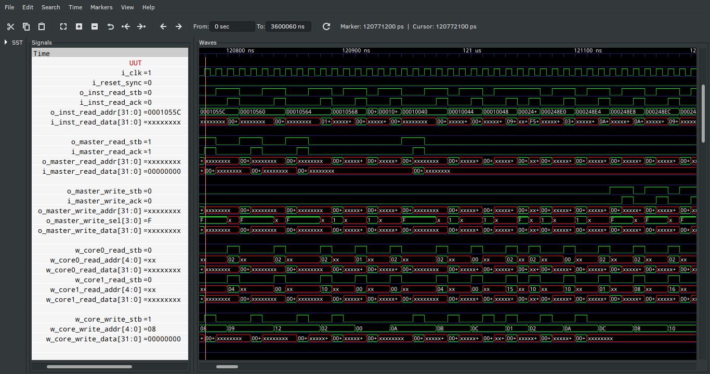

## ORC_R32I

### Abstract

A 32-bit RISC-V ISA I instructions implementation.

### Performance

#### Dhrystone Benchmark (Version 2.1)

No two Dhrystone benchmark are the same since this is a compiler/core benchmark. Therefore a third party core was benchmarked and included for comparison.

Dhrystone test bench found in the picorv32 repo (https://github.com/cliffordwolf/picorv32/tree/master/dhrystone) was used and the same compiled code (hex file) on all cores for comparison.
Implementation           | CFLAGS (-march=) | Runs |         User Time         | Cycles/Instruction | Dhrystones/Sec/MHz | DMIPS/MHz
:----------------------- | :--------------: | :--: | :-----------------------: | :----------------: | :----------------: | :-------:
ORC_R32IM      (this )   |       rv32i      | 100  | 58072 cycles,  29036 insn |       2.000        |       1722         |   0.980
ORC_R32I_BRAM  (branch)  |       rv32i      | 100  | 85802 cycles,  29036 insn |       2.955        |       1165         |   0.663
picorv32                 |       rv32i      | 100  | 113154 cycles, 29036 insn |       3.897        |        883         |   0.502
picorv32 (no look ahead) |       rv32i      | 100  | 153707 cycles, 29036 insn |       5.293        |        650         |   0.369

#### Clocks Per Instructions
 _________\ Pipeline Stage   Instruction \ ___________ | Fetch | Decode | Register | Response | Total Clocks
:---------- | :---: | :----: | :------: | :------: | :----------:
LUI         |   ✔️   |    ✔️   |          |          |      2
AUIPC       |   ✔️   |    ✔️   |          |          |      2
JAL         |   ✔️   |    ✔️   |          |          |      2
JALR        |   ✔️   |    ✔️   |     ✔️    |          |      2
BRANCH      |   ✔️   |    ✔️   |     ✔️    |          |      2
R-R         |   ✔️   |    ✔️   |     ✔️    |          |      2
R-I         |   ✔️   |    ✔️   |     ✔️    |          |      2
Load        |   ✔️   |    ✔️   |     ✔️    |    ✔️     |      3*
Store       |   ✔️   |    ✔️   |     ✔️    |    ✔️     |      3*

_*minimum_

#### Simulation Waveform Output 

##### This is a waveform snippet for reference 

 

### Current State

**_Under Progress_**

#### To Do

1.  Add more documentation 
2.  Write more efficient code.

_**Note:**_ 

To synthesize the code for the Sipeed PriMER ANLOGIC FPGA BOARD simply set the parameter `P_IS_ANLOGIC` to 1. When using yosys or Xilinx using Vivado set the parameter to 0. This parameter is declared at the top level wrapper, ORC_R32IMAZicsr.v.

Sadly the division uses more DSP blocks than what the Lattice 5k has to offer and the ANLOGIC FPGA in the SiPEED board only has enough DSP block for a pipelined division. I will create a faster non-pipeline division module for larger fpgas like the A7 or S7 found in the Arty boards. Also Vivado results show the most critical timing path is associated to the DSP blocks, therefore there is a risk of having to reduce the clock rate for a non-pipelined version.
