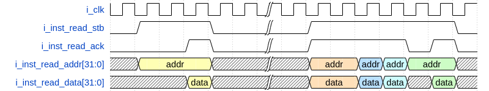

# ORC_R32I Synthesizable Unit Specification

Document        | Metadata
:-------------- | :------------------
_Version_       | v1.0.0
_Prepared by_   | Jose R Garcia
_Created_       | 2020/12/25 13:39:12
_Last modified_ | 2021/13/07 00:52:39
_Project_       | ORCs

## Abstract

The ORC_R32I is an implementation of the RISC-V 32-bit 'I' ISA extensions targeting small FPGAs. It is a single threaded _hart_.

## Table Of Contents

<!-- TOC depthFrom:1 depthTo:6 withLinks:1 updateOnSave:1 orderedList:0 -->

- [ORC_R32I Synthesizable Unit Specification](#orc_r32i-synthesizable-unit-specification)
  - [Abstract](#abstract)
  - [Table Of Contents](#table-of-contents)
  - [2 Design](#2-design)
    - [2.1 HART Core](#21-hart-core)
    - [2.2 Memory Backplane](#22-memory-backplane)
    - [2.3 CSRs](#23-csrs)
  - [3 Clocks and Resets](#3-clocks-and-resets)
  - [4 Interfaces](#4-interfaces)
    - [4.1 Instruction WB Master Read](#41-instruction-wb-master-read)
    - [4.2 Memory and I/O WB Master Read](#42-memory-and-io-wb-master-read)
    - [4.3 Memory and I/O WB Master Write](#43-memory-and-io-wb-master-write)
  - [5 Configurable Parameters](#5-configurable-parameters)
  - [6 Memory Map](#6-memory-map)
    - [6.1 General Register, mem0 and mem1](#61-general-register-mem0-and-mem1)
  - [7 Resource Costs](#7-resource-costs)
    - [7.1 Sipeed_PriMER (Anlogic Eagle FPGA)](#71-sipeed_primer-anlogic-eagle-fpga)
    - [7.2 Yosys Synthesis](#72-yosys-synthesis)
  - [8 Performance](#8-performance)
    - [8.1 Dhrystone Benchmark (Version 2.1)](#81-dhrystone-benchmark-version-21)
  - [9 Directory Structure](#9-directory-structure)
  - [10 Simulation](#10-simulation)
  - [11 Synthesis](#11-synthesis)
  - [12 Build](#12-build)

<!-- /TOC -->

 ## 1 Syntax and Abbreviations

Term        | Definition
:---------- | :----------------------------
0b0         | Binary number syntax
0x0000_0000 | Hexadecimal number syntax
bit         | Single binary digit (0 or 1)
BYTE        | 8-bits wide data unit
DWORD       | 32-bits wide data unit
FPGA        | Field Programmable Gate Array
HART        | Hardware thread
ISA         | Instruction Set Architecture
LSB         | Least Significant bit
MSB         | Most Significant bit
WB          | Wishbone Interface

## 2 Design

The ORC_R32I uses a Harvard architecture, separating the interface used to access the instructions from the interface used to access external devices. The general purpose register are implemented in LUTRAMs or Distributed RAMs. In order to access the rs1 and rs2 simultaneously two copies of the general purpose register are created.

### 2.1 HART Core

The Program Counter process fetches the instructions by asserting the instruction interface strobe signal, thus validating the address signal and waits for the acknowledge to be asserted in response which validates the data signal.

The unit consumes instructions as portrayed by Figure 1.

|  
| :----------------------------:
| Figure 2 : Simulation waveform

The instruction interface can work as both an Asynchronous and Synchronous Wishbone Interface.

### 2.2 Memory Backplane

TBD (but it is basically an access controller to the registers)

### 2.3 CSRs

Only mcycle and minstr are implemented to be able to run the Dhrystone benchmark.

## 3 Clocks and Resets

Signals        | Initial State | Direction | Definition
:------------- | :-----------: | :-------: | :--------------------------------------------------------------------
`i_clk`        |      N/A      |    In     | Input clock. Streaming interface fall within the domain of this clock
`i_reset_sync` |      N/A      |    In     | Synchronous reset. Used to reset this unit.

## 4 Interfaces

The ORC_R32I employs independent interfaces for reading the memory containing the instructions to be decoded and reading and writing to other devices such as memories and I/O devices.

### 4.1 Instruction WB Master Read

Signals            | Initial State | Dimension | Direction | Definition
:----------------- | :-----------: | :-------: | :-------: | :-----------------------
`o_inst_read_stb`  |      0b0      |   1-bit   |    Out    | Read request signal.
`i_inst_read_ack`  |      N/A      |   1-bit   |    In     | Read acknowledge signal.
`o_inst_read_addr` |  0x0000_0000  | `[31:0]`  |    Out    | Read Address signal.
`i_inst_read_data` |      N/A      | `[31:0]`  |    In     | Read response data.

### 4.2 Memory and I/O WB Master Read

Signals              | Initial State | Dimension | Direction | Definition
:------------------- | :-----------: | :-------: | :-------: | :-----------------------
`o_master_read_stb`  |      0b0      |   1-bit   |    Out    | Read request signal.
`i_master_read_ack`  |      N/A      |   1-bit   |    In     | Read acknowledge signal.
`o_master_read_addr` |  0x0000_0000  | `[31:0]`  |    Out    | Read Address signal.
`i_master_read_data` |      N/A      | `[31:0]`  |    In     | Read response data.

### 4.3 Memory and I/O WB Master Write

Signals               | Initial State | Dimension | Direction | Definition
:-------------------- | :-----------: | :-------: | :-------: | :------------------------
`o_master_write_stb`  |      0b0      |   1-bit   |    Out    | Write request signal.
`i_master_write_ack`  |      N/A      |   1-bit   |    In     | Write acknowledge signal.
`o_master_write_addr` |  0x0000_0000  | `[31:0]`  |    Out    | Write Address signal.
`i_master_read_data`  |      N/A      | `[31:0]`  |    In     | Write response data.
`o_master_write_sel`  |      0x0      |  `[3:0]`  |    Out    | Write byte enable

## 5 Configurable Parameters

Parameters              | Default | Description
:---------------------- | :-----: | :--------------------------------------------------------------------------------------------------------------------------
`P_FETCH_COUNTER_RESET` |    0    | Initial address fetched by the Instruction WB Read.
`P_MEMORY_ADDR_MSB`     |    4    | Log2(Number_Of_Total_Register)-1
`P_MEMORY_DEPTH`        |   32    | Memory space depth.
`P_IS_ANLOGIC`          |    0    | When '0' it generates generic BRAM and multiplier. When '1' it generates ANLOGIC BRAMs and DSPs targeting the SiPEED board.

## 6 Memory Map

Memory Space | Address Range | Description
:----------: | :-----------: | :-----------------
    mem0     |    [0:31]     | General Registers.
    mem1     |    [0:31]     | General Registers.

### 6.1 General Register, mem0 and mem1

Address                   | Bits | Access | Reset       | Description
:-----------------------: | :--: | :----: | :---------: | :----------------
[0x0000_0000:0x0000_001F] | 31:0 | RW     | 0x0000_0000 | General register.

## 7 Resource Costs

### 7.1 Sipeed_PriMER (Anlogic Eagle FPGA)

_These results should be considered experimental as work is still under progress and this only accounts for I and M instructions. Remember to set P_IS_ANLOGIC = 1 in the ORC_R32I module_

|Utilization Statistics|     |                  |       |
| :------------------ | ---: | :--------------: | ----: |
| #lut                | 1995 |   out of  19600  | 10.18%|
| #reg                |  286 |   out of  19600  |  1.46%|
| #le                 | 2057 |          -       |     - |
|   #lut only         | 1771 |   out of   2908  | 86.10%|
|   #reg only         |   62 |   out of   2908  |  3.01%|
|   #lut&reg          |  224 |   out of   2908  | 10.89%|
| #dsp                |    0 |   out of     29  |  0.00%|
| #bram               |    0 |   out of     64  |  0.00%|
|   #bram9k           |    0 |        -         |  -    |
|   #fifo9k           |    0 |        -         |   -   |
| #bram32k            |    0 |   out of     16  |  0.00%|
| #pad                |  204 |   out of    188  |108.51%|
|   #ireg             |    8 |        -         |   -   |
|   #oreg             |    0 |        -         |   -   |
|   #treg             |    0 |        -         |   -   |
| #pll                |    0 |   out of      4  |  0.00%|

|Report Hierarchy Area: |     |       |       | |
:-------- | :-------- | :---- |:------| :---- |
| Instance | Module   | le    | lut   | seq   |
| top      | ORC_R32I | 2057  | 1995  | 286   |

### 7.2 Yosys Synthesis
 Yosys version: `Yosys 0.9+3755 (git sha1 442d19f6, gcc 10.2.0-13ubuntu1 -fPIC -Os)`

 Yosys script: `syn_ice40.ys`

| Resource                  | Usage Count |
| :------------------------ | ----------: |
| Number of  wire           |        2043 |
| Number of wire bits       |       10015 |
| Number of public wires    |        2043 |
| Number of public wire bits|       10015 |
| Number of memories        |           0 |
| Number of memory bits     |           0 |
| Number of processes       |           0 |
| Number of cells  --- SB_CARRY   --- SB_DFF   --- SB_DFFE   --- SB_DFFESR    --- SB_DFFESS   --- SB_DFFSR   --- SB_DFFSS   --- SB_LUT4 |               5176 393 16 1028 171 2 104 1 3461|

## 8 Performance

### 8.1 Dhrystone Benchmark (Version 2.1)

No two Dhrystone benchmark are the same since this is a compiler/core benchmark. Therefore a third party core was benchmarked and included for comparison.

Dhrystone test bench found in the picorv32 repo (https://github.com/cliffordwolf/picorv32/tree/master/dhrystone) was used and the same compiled code (hex file) on all cores for comparison.
Implementation           | CFLAGS (-march=) | Runs |         User Time         | Cycles/Instruction | Dhrystones/Sec/MHz | DMIPS/MHz
:----------------------- | :--------------: | :--: | :-----------------------: | :----------------: | :----------------: | :-------:
ORC_R32I (bypass)   Average Expected ->    Theoretical Maximums -> |       rv32i      | 100  |   58072 cycles,  29036 insn   39858 cycles, 29036 insn |   2.000   1.372|   1722   2508 |   0.980   1.427
picorv32                 |       rv32i      | 100  | 113154 cycles, 29036 insn |       3.897        |        883         |   0.502
picorv32 (no look ahead) |       rv32i      | 100  | 153707 cycles, 29036 insn |       5.293        |        650         |   0.369

    Note: The Average expected performance is the value expected by the Instruction interface working synchronously with minimal back pressure. Theoretical Maximums are obtained by simulating a prefect instruction cache.

## 9 Directory Structure

- `build` _contains build scripts, synthesis scripts, build constraints, build outputs and bitstreams_
- `sim` _contains simulation scripts and test bench files_
- `source` _contains source code files (*.v)_

## 10 Simulation

TBD

## 11 Synthesis

TBD

## 12 Build

TBD
